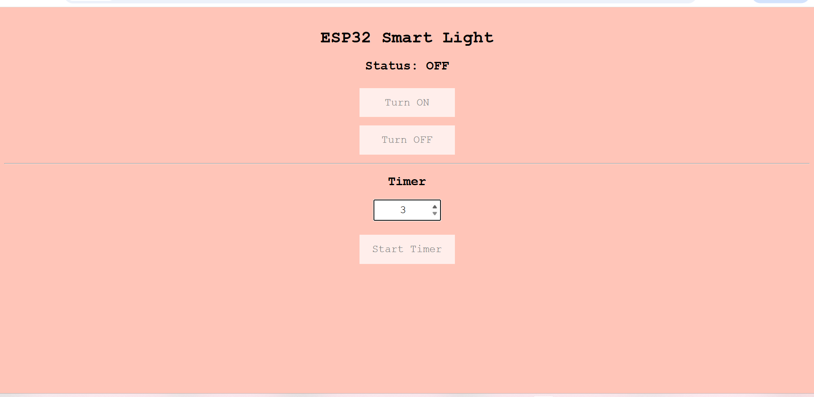
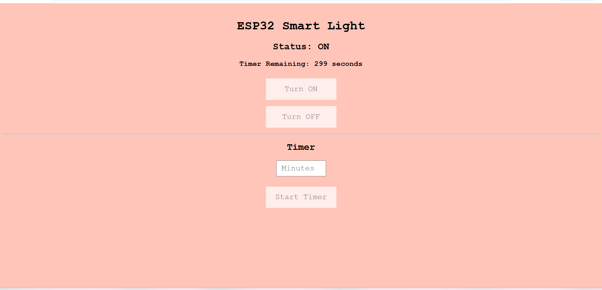

# ESP32 Smart Light

## Overview
A smart home lighting system built using an ESP32 and a single-channel relay module. The project hosts a web server on the local network, permitting remote control of a light bulb through any web browser. The system also has an integrated automatic timer that switches off the light after a user-defined duration.

## Acknowledgements
The following Bluetooth-controlled light tutorial inspired this project:
https://www.youtube.com/watch?v=ZjVWXPnAgoE&t=1214s

The original project demonstrated Bluetooth control using an ESP32. This implementation extends the concept by replacing Bluetooth with Wi-Fi communication and adding a browser-based interface and timer functionality.

## Features
- Wifi-based control using an ESP32
- Browser-accessible control interface
- Manual ON/OFF switching
- Automatic timer 
- Status display
- Mobile-friendly web interface
- No mobile application required

## Hardware
- ESP32 DevKit V1 (ESP32-WROOM-32)
- 1-Channel Relay Module (JQC-3FF-S-Z / SRD-05VDC-SL-C)
- 240V Light Bulb
- Breadboard
- Breadboard Power Supply
- Jumper Wires
- USB Cable

## Warning
Please be careful when building this circuit as it interfaces with 240 V AC mains electricity. Make sure to disconnect power while modifying it.  

## Circuit Diagram


### Light OFF


### Light ON


### Web Interface


### Timer Countdown


## The Deeper Deets: How It Works
1. The ESP32 connects to the local Wi-Fi network.
2. A web server is started on the ESP32.
3. The assigned IP address is displayed in the Serial Monitor.
4. Opening the IP address in a web browser loads the control page.
5. The user can:
   - Turn the light ON
   - Turn the light OFF
   - Start an automatic timer
6. When the timer expires, the ESP32 automatically deactivates the relay, switching the light off.

## How to make your own
1. Connect the required components 
2. Enter your Wi-Fi credentials and then upload the code to the ESP32

```cpp
const char* ssid = "wifi name";
const char* password = "password;
```

3. Open the Serial Monitor (115200 baud).
4. The Serial Monitor will display the assigned IP address, for example:

```
Connecting to Wi-Fi...
Connected!
IP Address: xxxxxxxxxxxxx
Web Server Started
```

5. Open any web browser on a device connected to the **same Wi-Fi network**.
6. Enter the displayed IP address into the address bar:

```
http://xxxxxxxxxxxxx
```

7. You're done! However, you can customize the webpage as well :) Edit the bg or change the font; have fun! Play around with it! You just need to upload the code again


